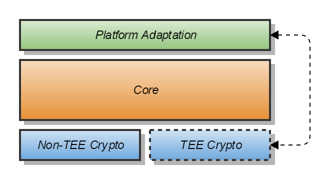

# Apache Milagro Mobile SDK Core

## Architecture and API

### System Overview
The Mobile SDK is a software library that allows mobile application developers to use the Apache Milagro authentication scheme for authenticating their end-users. It is a "native" library which contains native API for each platform:
- Java API for Android
- Objective-C API for iOS
- C# API for Windows Phone.

The SDK implements a Client in the Apache Milagro authentication scheme. It is divided into three layers:
* Crypto
* Core
* Platform Adaptation

#### Crypto

The Crypto layer performs all the cryptographic operations required during the Milagro Registration and Authentication process.
It is currently based on the _Apache Milagro Crypto_ library.
A Trusted Execution Environment (TEE) may be available on some Android platforms (mainly on Samsung devices).
The TEE allows for hardware-secured execution of sensitive code and storage of sensitive data.
The Mobile SDK is designed in such a way that when the TEE is present, the Crypto code might run on it allowing sensitive data to be stored on it.
Thus, two variants of Crypto layer are made available, _Non-TEE Crypto_ and _TEE Crypto_.
They provide the same API towards the Core layer and so should be interchangeable.

The Apache Milagro Crypto is a C library which the Non-TEE Crypto wraps with platform-agnostic C++ code.

#### Core

The Core layer implements the logic and flow of the Apache Milagro Authentication Platform.
It is written in C++ and is platform-agnostic.
As it is not solely able to perform certain tasks, such as storing data on the device, or making HTTP requests, it invokes the _Platform Adaptation_ layer through interfaces provided during the Core initialization, to do them.

#### Platform Adaptation

This layer is implemented separately for every platform, since it is the only platform-specific component in the SDK.
It provides a thin adaptation layer for the Core's C++ API to the native languages, Java, Objective-C or C#, for the different Mobile Platforms.
It also provides platform-specific implementation of Secure and Non-Secure Storage and HTTP Requests.

For the platform-specific API's see:
* [Android SDK API](https://github.com/apache/incubator-milagro-mfa-sdk-android)
* [iOS SDK API](https://github.com/apache/incubator-milagro-mfa-sdk-ios)
* [Windows Phone SDK API](https://github.com/apache/incubator-milagro-mfa-sdk-wp)

### Core API

The Core layer is the central part of the Apache Milagro SDK.
It implements the functionality of a Milagro Client and drives the communication with the Milagro MFA Services.
The SDK Core (and Crypto) are implemented in a portable way, using C/C++ programming languages, to enable them to be compiled for different platforms such as a mobile or a desktop one.
Most of the platforms provide a native API to make HTTP requests and store data.
The Core utilizes the services on the specific platform it was compiled to, and runs on top of them.
Hence, it works with Interfaces for those platform-specific services, as they are implemented at the _Platform Adaptation Layer_.

For further details refer to:
* [Core API Interfaces](docs/core-api-interfaces.md)
* [Core API for Apache Milagro - `MPinSDK`](docs/core-api-mpinsdk.md)
* [Apache Milagro - Main Flows](docs/mpinsdk-flows.md)
* [Core API for MIRACL MFA Platform - `MfaSDK`](docs/core-api-mfasdk.md)
* [MIRACL MFA Platform - Main Flows](docs/mfasdk-flows.md)
